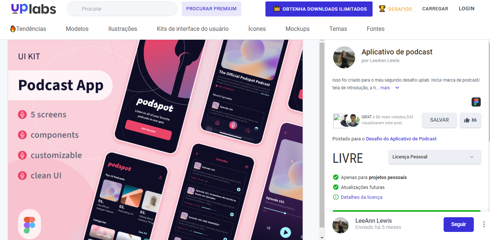
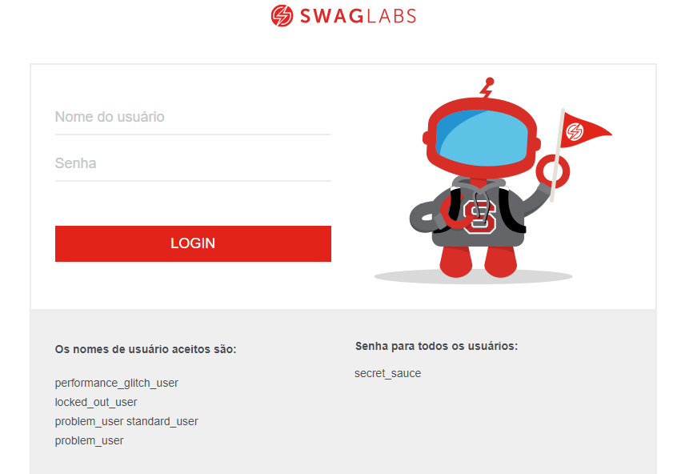

# Portfólio
Esse projeto tem como finalidade mostrar meu trabalho de Análise de Requisitos e Plano de Teste. 

Nesse repositório você irá encontrar a análise de (2) projetos, sendo um:

- Análise de requisitos de um prótotipo Figma
- Plano de teste de um Site

## Portfólio Análise de Requisitos

- Prótotipo do Figma [PodcastApp](https://www.uplabs.com/posts/podcast-app-27e7dba2-b5d6-40f8-be0f-52d6710b9af7)

## Portfólio Plano de Teste

- Site utilizado para a elaboração do Plano [Saucedemo](https://www.saucedemo.com/)

